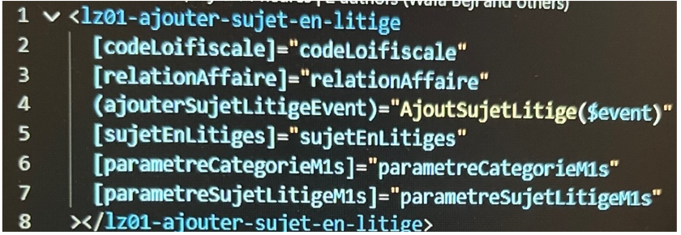

[Tout](https://cdiese.fr/angular-component/)

Le décorateur `@Component{()}` définit les métadonnées de votre composant.
  - Le `sélecteur:` nous permet de définir comment Angular identifie lorsque le composant est utilisé en HTML.
    

- `OnInit` est un hook de cycle de vie qui est appelé après qu'Angular a initialisé toutes les propriétés liées aux données d'une directive. Lors de la phase de détection de changement.
- Le décorateur `@Input()` permet d’implémenter des paramètres d’entrée dans le composant enfant qu’on pourra initialiser à partir du composant parent.

