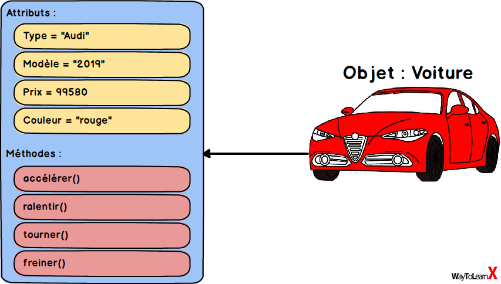

# Programmation Orientée Objet
La Programmation Orientée Objet (ou POO) est un paradigme (modèle) de programmation dans lequel les programmes sont écrits et structurés autour des objets.
## Exemple
un exemple dans la vrai vie, une voiture est un objet, avec ses attributs (type, modèle, prix, couleurs, etc…) et ses méthodes (accélérer, ralentir, tourner, freiner, etc.).

.

# Principes de la POO
- **L’encapsulation** masque les détails d’implémentation d’une classe à d’autres objets.
- **L’héritage** est un moyen de former de nouvelles classes en utilisant des classes déjà définies.
- **Le polymorphisme** est le processus d’utilisation d’un opérateur ou d’une fonction de différentes manières pour différentes entrées de données.
- **L’abstraction** simplifie la réalité complexe en modélisant des classes appropriées au problème.

# Les principes du Clean Code
- Un code aussi simple que possible : KISS (construire leur code de façon aussi simple que possible)
- Éviter les répétitions inutiles : DRY (chaque fonctionnalité doit avoir une seule et unique représentation).
- Supprimer ce qui est inutile : YAGNI
# Principe solide 

