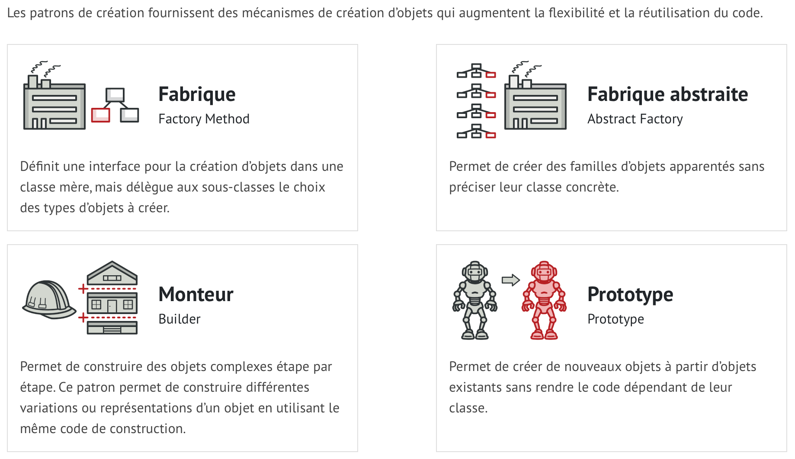
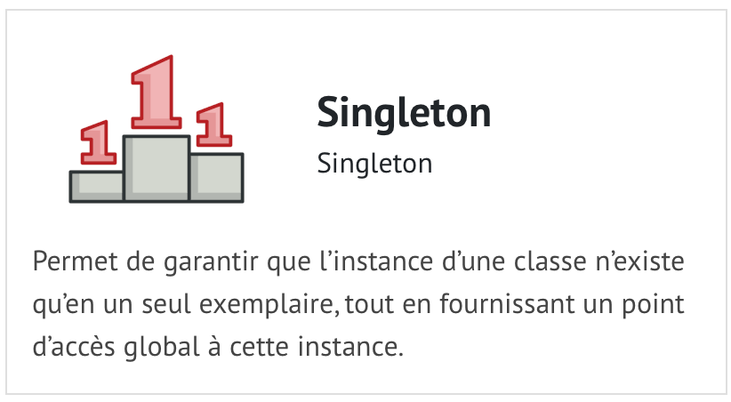

# Programmation Orientée Objet
La Programmation Orientée Objet (ou POO) est un paradigme (modèle) de programmation dans lequel les programmes sont écrits et structurés autour des objets.
## Exemple
un exemple dans la vrai vie, une voiture est un objet, avec ses attributs (type, modèle, prix, couleurs, etc…) et ses méthodes (accélérer, ralentir, tourner, freiner, etc.).

.

# Principes de la POO
- **L’encapsulation** masque les détails d’implémentation d’une classe à d’autres objets.
- **L’héritage** est un moyen de former de nouvelles classes en utilisant des classes déjà définies.
- **Le polymorphisme** est le processus d’utilisation d’un opérateur ou d’une fonction de différentes manières pour différentes entrées de données.
- **L’abstraction** simplifie la réalité complexe en modélisant des classes appropriées au problème.
  
# Une Class
Une classe est un plan de déclaration et de création d'objets.

# Un Objet
Un objet est une instance de classe qui permet aux programmeurs d'utiliser des variables et des méthodes à partir de l'intérieur de la classe.

# Les principes du Clean Code
- Un code aussi simple que possible : KISS (construire leur code de façon aussi simple que possible)
- Éviter les répétitions inutiles : DRY (chaque fonctionnalité doit avoir une seule et unique représentation).
- Supprimer ce qui est inutile : YAGNI
# Principe solide 
| S |  Responsabilité unique (Single responsibility principle)|  Une classe doit avoir une et une seule responsabilité|
|:--|:--|:--|
| O | Ouvert/fermé (Open/closed principle) | Une classe doit être ouverte à l'extension, mais fermée à la modification |
| L | Substitution de Liskov (Liskov Substitution Principle) | Une instance de type T doit pouvoir être remplacée par une instance de type G, tel que G sous-type de T, sans que cela modifie la cohérence du programme |
| I |Ségrégation des interfaces (Interface segregation principle)  |  Préférer plusieurs interfaces spécifiques pour chaque client plutôt qu'une seule interface générale|
| D | Inversion des dépendances (Dependency Inversion Principle) | Il faut dépendre des abstractions, pas des implémentations |

# Patrons de conception

[Patrons de conception]([https://github.com/kousseylakadri/Entretie/edit/main/README.md](https://refactoring.guru/fr/design-patterns/creational-patterns)https://refactoring.guru/fr/design-patterns/creational-patterns)

.

.
